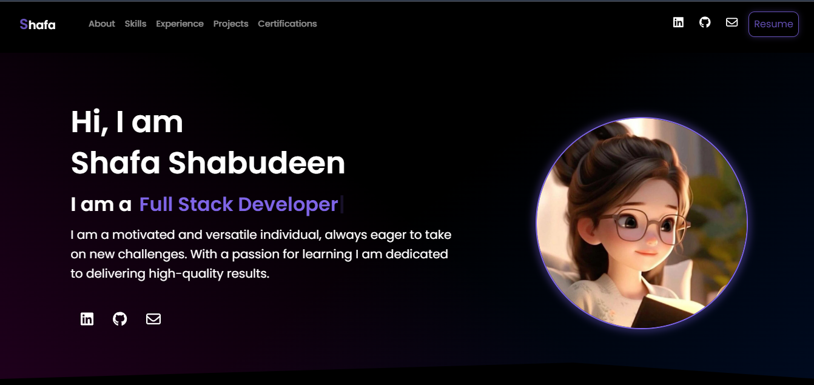

# Personal Portfolio



This is my personal portfolio website built using React with Vite and styled with Bootstrap. It showcases my skills, projects, experience, and certifications.

## Features

- **Responsive Design**: The website is fully responsive, ensuring optimal viewing experience across various devices and screen sizes.

- **Interactive Components**: Utilizes interactive components and animations to enhance user engagement and visual appeal.

- **Skill Showcase**: Highlights my skills and areas of expertise, providing visitors with insights into my capabilities.

- **Project Gallery**: Showcases my projects with descriptions, images, and links to live demos or GitHub repositories.

- **Experience Section**: Details my professional experience, including roles, responsibilities, and achievements.

- **Certifications**: Displays certifications earned, providing credibility and validation of skills.

## Technologies Used

- React: A JavaScript library for building user interfaces.
- Vite: A fast build tool that significantly improves the frontend development experience.
- Bootstrap: A popular CSS framework for developing responsive and mobile-first websites.
- FontAwesome: A library of scalable vector icons that can be customized with CSS.

## Getting Started

1. Clone this repository to your local machine:

   ```bash
   git clone https://github.com/shafa-shabudeen/Personal-Portfolio-React.git

2. Navigate to the project directory:
   ```bash
   cd personal-portfolio

3. Install dependencies:
   ```bash
   npm install

4. Run the development server:
   ```bash
   npm run dev

5. Open your browser and visit http://localhost:3000 to view the website.

## Live Website
  Visit the live website: <a href='https://shafa-shabudeen.github.io/Personal-Portfolio-React/'>Personal Portfolio</a>
